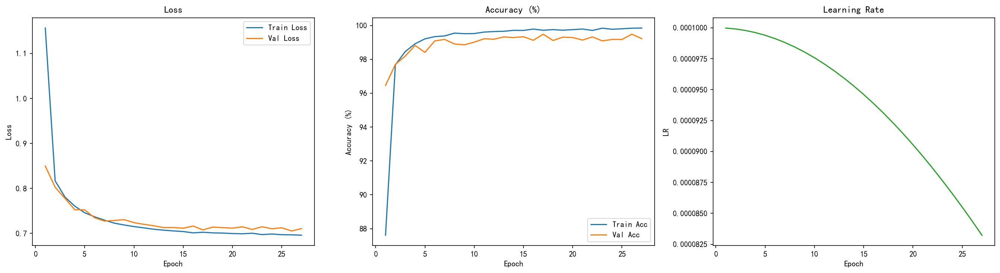
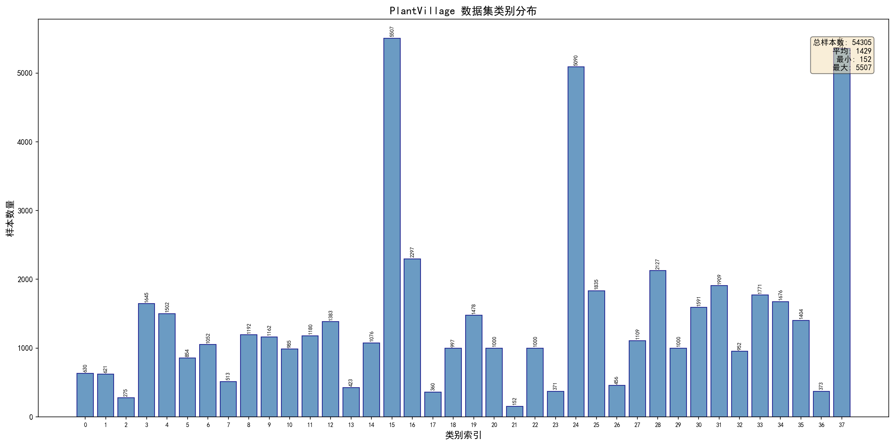
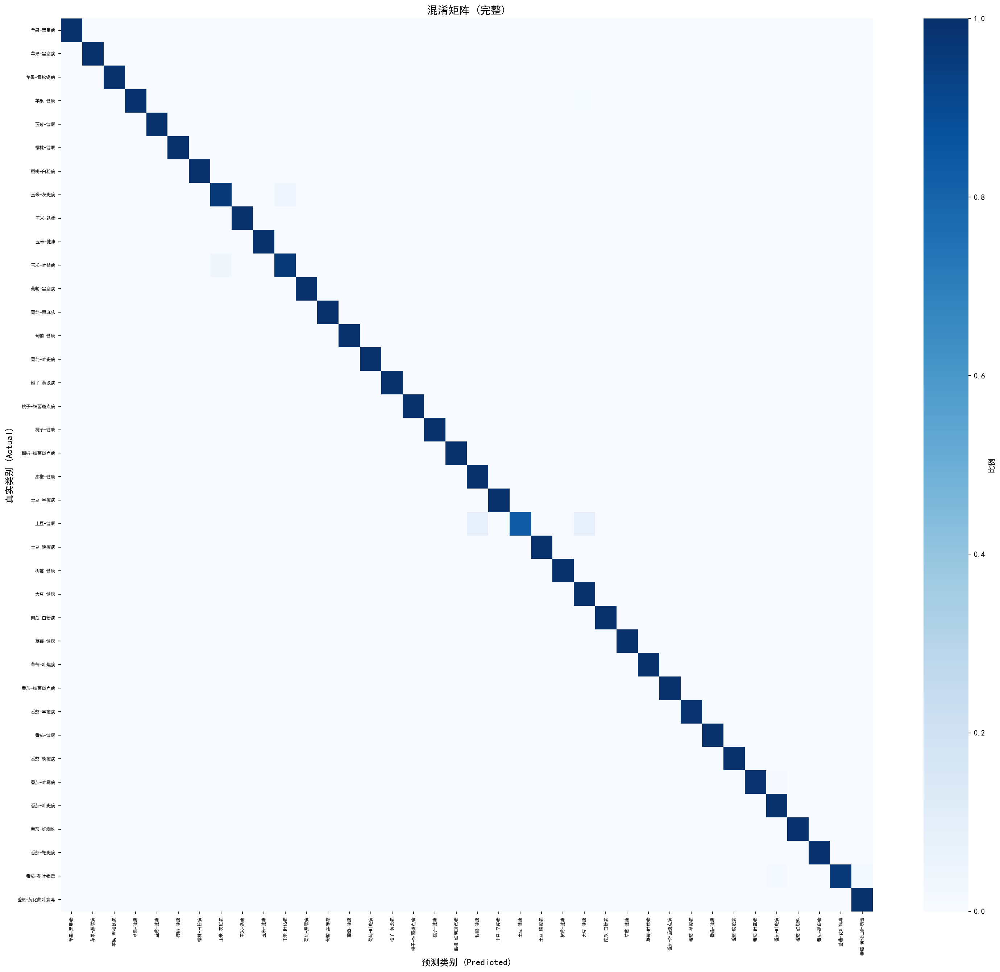
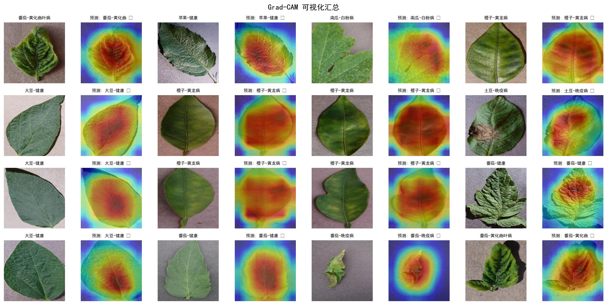

# 补充材料（Supplementary Material）

> 本补充材料不计入 4-6 页限制，作为独立文件提交。
> 不包含任何超过 300MB 的数据集文件或模型权重。

---

## 1. 项目复现说明（Code & Reproducibility）

### 1.1 运行环境
- Python: 3.10+
- PyTorch: 2.9+
- CUDA: 11.8+（可选，用于 GPU 加速）

### 1.2 依赖安装
```bash
# 使用 uv（推荐）
uv sync

# 或使用 pip
pip install -r requirements.txt
```

### 1.3 数据集获取与划分
```bash
# 下载数据集
python DataDownload.py

# 生成训练/验证/测试划分
python -m data.split_dataset
```

数据集位于 `datasets/plantvillage dataset/`，划分索引保存在 `datasets/splits/`。

### 1.4 训练与评估
```bash
# 训练模型
python main_train.py

# 测试评估
python -m evaluation.test
```

---

## 2. 补充实验结果（Additional Experiments）

### 2.1 训练曲线
我们给出训练/验证损失与准确率曲线，用于展示模型收敛过程。



> 如 `training_curves.png` 未生成，可通过 `evaluation/visualization.py` 绘制。

### 2.2 类别分布与划分比例
展示数据集类别分布以及划分比例的统计图。




### 2.3 完整混淆矩阵
完整 38×38 混淆矩阵用于分析所有类别的预测情况。



### 2.4 Grad-CAM 细粒度可视化
补充更多 Grad-CAM 结果示例，展示模型关注区域与病灶位置的对应关系。



---

## 3. 额外分析（Extra Analysis）

### 3.1 类别样本可视化
展示不同病害类别样本，说明类别间细粒度差异。


### 3.2 数据增强可视化
展示旋转、翻转、颜色抖动与 Cutout 的增强效果。


---

## 4. 代码结构说明（Code Structure）

```
final-project/
├── data/                      # 数据处理模块
├── models/                    # 模型定义
├── training/                  # 训练流程
├── evaluation/                # 评估模块
├── utils/                     # 工具函数
├── datasets/                  # 数据集目录
├── checkpoints/               # 模型权重保存（不提交）
└── results/                   # 结果输出
```


